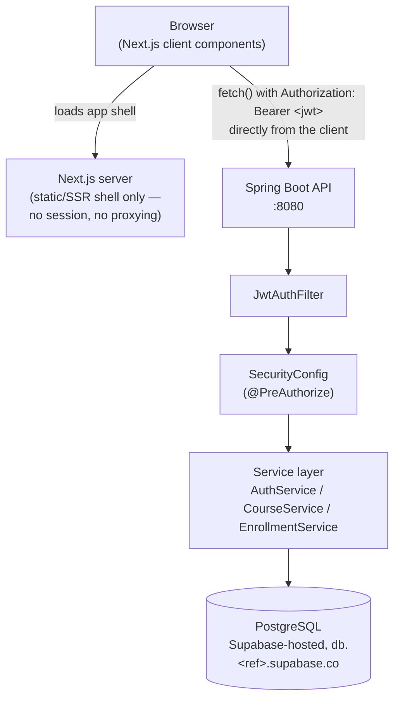
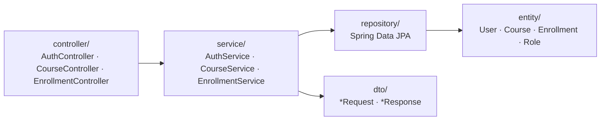
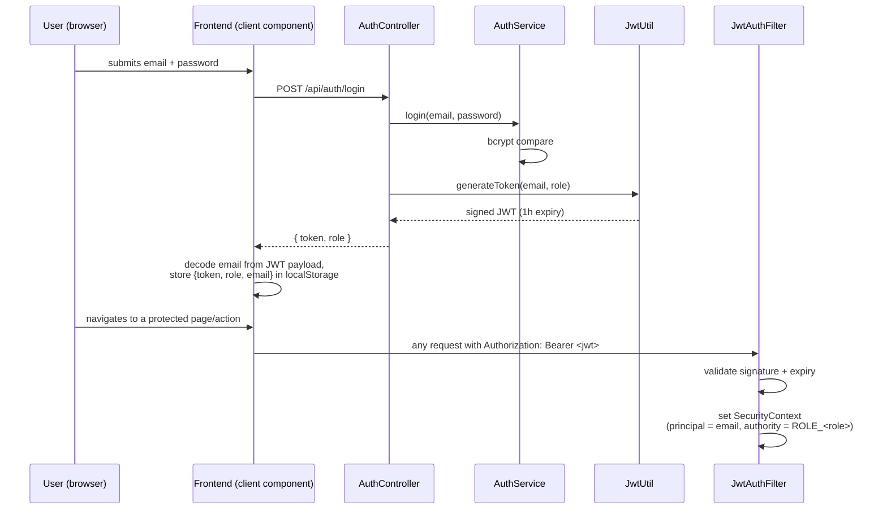
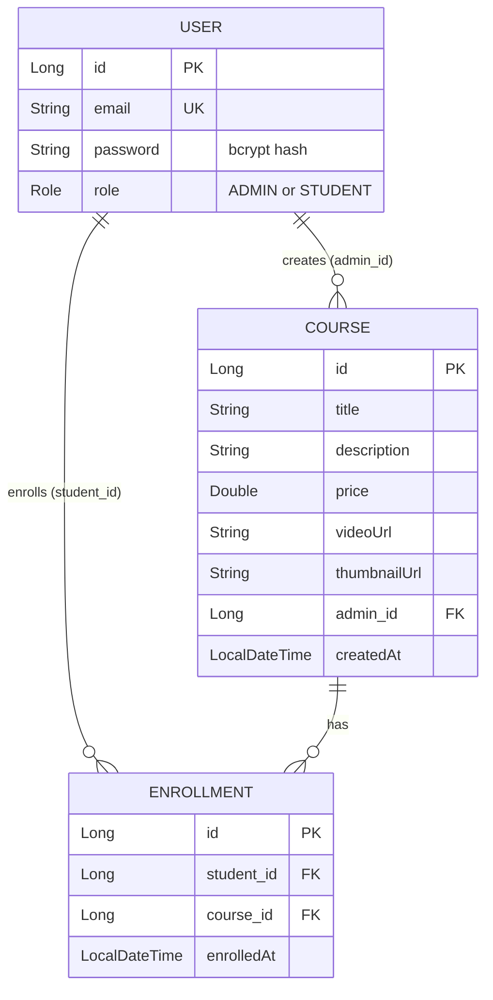

# LMS — Requirements & Architecture

This document describes the system **as it is currently built**: a Spring Boot REST API (`lms-backend/`) and a Next.js frontend (`frontend/`). It is not a wishlist — every requirement below traces to actual code. Known gaps and bugs are called out explicitly rather than glossed over, so this doubles as the honest baseline for what to fix next.

## 1. System overview

A small Learning Management System for one school: an admin publishes courses (with a gated video), students browse a public catalog, register, enroll, and unlock the video for courses they've enrolled in.

Two deployable units:

| Unit | Stack | Location |
|---|---|---|
| Backend API | Java 17, Spring Boot 3.3.4, Spring Security, Spring Data JPA, PostgreSQL (Supabase-hosted) | `lms-backend/` |
| Frontend | Next.js 16 (App Router, TypeScript, Tailwind v4) | `frontend/` |

The frontend is a pure API client — no server-side session, no BFF layer. All authenticated calls read a JWT from `localStorage` and attach it as a bearer token.

## 2. Actors

- **Anonymous visitor** — can browse the course catalog and register.
- **Student** (`Role.STUDENT`) — can enroll in courses and view unlocked video for courses they're enrolled in.
- **Admin** (`Role.ADMIN`) — can create, edit, and delete courses.

There is no "instructor" role distinct from admin, no multi-tenant/multi-school concept, and no super-admin tier — every admin has identical, global permissions over every course.

## 3. Functional requirements

### 3.1 Authentication & accounts

| ID | Requirement | Implementation |
|---|---|---|
| F1 | A visitor can register an account with email, password, and role. | `POST /api/auth/register` → `AuthController` → `AuthService.register` |
| F2 | Passwords are never stored in plaintext. | `BCryptPasswordEncoder` (`SecurityConfig`) |
| F3 | A registered user can log in with email + password and receive a bearer token. | `POST /api/auth/login` → returns `{token, role}` |
| F4 | Sessions are stateless; the token is a signed JWT carrying email (subject) and role (claim), 1-hour expiry. | `JwtUtil`, HS256 |
| F5 | Every request presenting `Authorization: Bearer <token>` is authenticated transparently. | `JwtAuthFilter` (runs once per request, populates `SecurityContext`) |
| F6 | A user can check who they're logged in as. | `GET /api/auth/me` |
| F7 | The frontend persists the session (token + role + email decoded from the JWT) in `localStorage` and attaches it to every authenticated request. | `frontend/src/lib/auth.tsx`, `frontend/src/lib/api.ts` |
| F8 | The frontend's registration form only offers a Student account — no role selector exposed in the UI. | `frontend/src/app/register/page.tsx` (UI-level mitigation only — see §6, R1) |

### 3.2 Course catalog

| ID | Requirement | Implementation |
|---|---|---|
| F9 | Anyone (including anonymous visitors) can list all courses. | `GET /api/courses` (public) |
| F10 | Anyone can view a single course's title, description, price, and thumbnail. | `GET /api/courses/{id}` (public) |
| F11 | A course's video URL is included in the single-course response only if the viewer is enrolled in that course **or** is the admin who created it; otherwise it's `null`. | `CourseService.getCourseForViewer` via `CourseResponse` |
| F12 | The frontend shows a locked-video state (a stamp reading "Enroll to watch") whenever `videoUrl` is `null`, and a working link when it's present. | `frontend/src/app/courses/[id]/page.tsx`, `Stamp.tsx` |
| F13 | Only an admin can create a course (title, description, price, video URL, thumbnail URL). | `POST /api/courses`, `@PreAuthorize("hasRole('ADMIN')")` |
| F14 | Only an admin can update or delete any course. | `PUT` / `DELETE /api/courses/{id}` |
| F15 | The frontend gives admins a "Manage courses" view to list, create, edit, and delete courses. | `frontend/src/app/admin/courses/**` |

### 3.3 Enrollment

| ID | Requirement | Implementation |
|---|---|---|
| F16 | A student can enroll in a course. | `POST /api/enrollments/{courseId}`, `@PreAuthorize("hasRole('STUDENT')")` |
| F17 | A student cannot enroll in the same course twice. | Unique `(student_id, course_id)` DB constraint + explicit pre-check in `EnrollmentService.enroll` |
| F18 | A student can list their own enrollments. | `GET /api/enrollments/my` |
| F19 | The frontend shows a student's enrollments with the enrollment date, and links back to each course. | `frontend/src/app/my-enrollments/page.tsx` |
| F20 | Enrolling immediately unlocks that course's video in the UI (re-fetches the course after a successful enroll call). | `frontend/src/app/courses/[id]/page.tsx` |

## 4. Non-functional requirements

Scoped to what this system actually is — a single school's course registrar, not a multi-tenant SaaS. Numbers below are targets for *this* deployment, not aspirational scale.

### Performance
- Interactive pages should respond to a user action (login, enroll, save course) within ~1s under normal load; there's no caching layer, so this is bounded by PostgreSQL round-trip + JVM warm state.
- No pagination exists on `GET /api/courses` or `GET /api/enrollments/my` — acceptable while course/enrollment counts stay in the low hundreds; becomes a real requirement past that.

### Scalability
- Single-instance deployment target: tens of concurrent users, not thousands — appropriate at this scale and inappropriate beyond it, independent of hosting the database on Supabase.
- The backend is stateless (JWT auth, no server-side session store), so horizontal scaling of the API tier itself is not blocked by application code — but see R2 (JWT signing key) before ever running more than one instance.

### Availability
- No HA target is implied by the application design itself. Moving the database to Supabase (see ADR-005) inherits Supabase's managed backup/restore and infrastructure, which is strictly better than the prior self-hosted-with-no-backup-process state, but the app has no documented RPO/RTO of its own and no read replica.

### Security
- Authentication: JWT bearer tokens, 1-hour expiry, HS256.
- Authorization: role-based (`ADMIN`, `STUDENT`) via Spring Method Security (`@PreAuthorize`).
- Transport: no HTTPS termination configured in the app itself — expected to be handled by whatever sits in front of it in any real deployment (not yet documented anywhere).
- Data sensitivity: emails and bcrypt password hashes (PII, low-moderate sensitivity); no payment data is actually processed despite `Course.price` existing (it's descriptive only — there's no checkout/payment flow).
- Known gaps are tracked in §6, not hidden — this section states the *intended* model, not a claim that it's fully sound today.

### Reliability
- No defined RPO/RTO for data itself (see ADR-005 for what Supabase's managed backups do and don't cover). Schema evolution now has an audit trail via Flyway migrations (`src/main/resources/db/migration/`, see ADR-006), which R8 previously flagged as missing.

### Maintainability
- No CI pipeline, no automated tests (backend or frontend) exist yet. `./mvnw test` and `npm run build`/`npx eslint` are the only current verification steps, run manually.
- No structured logging or metrics; `spring.jpa.show-sql=true` is the only current observability signal, and it's a dev convenience, not production logging.

## 5. Architecture

### 5.1 High-level diagram



The frontend does **not** proxy API calls through its own server — every browser tab talks to `localhost:8080` (or `NEXT_PUBLIC_API_URL`) directly. There is no BFF, no API gateway, no rate limiting layer.

### 5.2 Backend layering



Controllers are thin and delegate immediately; business rules (password hashing, enrollment de-duplication, video-URL gating) live entirely in the service layer. There is no global exception handler — services throw plain `RuntimeException("message")`, which propagates to the client as an unstructured HTTP 500 today.

### 5.3 Auth sequence



### 5.4 Data model



`(student_id, course_id)` is a unique constraint on `ENROLLMENT`, enforced at both the DB and service layer.

### 5.5 Frontend structure

```
frontend/src/
  app/                     # one route per page (App Router)
    page.tsx               # catalog (public)
    login/, register/      # auth
    courses/[id]/          # course detail, locked-video stamp
    my-enrollments/        # student-only
    admin/courses/**       # admin-only CRUD
  lib/
    api.ts                 # fetch wrapper + response narrowing (see ADR-004)
    auth.tsx               # session context, backed by localStorage via useSyncExternalStore
    types.ts, format.ts
  components/               # Button, Field, CourseForm, Nav, LedgerRow, Stamp
```

Route-level access control is enforced client-side only (a page checks `session.role` in a `useEffect`/render guard and redirects). This is a UX convenience, **not** a security boundary — the real boundary is `@PreAuthorize` on the backend.

## 6. Key architectural decisions (ADRs)

### ADR-001: Stateless JWT authentication instead of server sessions

**Status**: Accepted (as built).

**Context**: The API needs to authenticate a decoupled SPA-style frontend that talks to it directly from the browser, with role-based access control on specific endpoints.

**Decision**: Use stateless JWT bearer tokens (`JwtAuthFilter` + `JwtUtil`), `SessionCreationPolicy.STATELESS`, no `HttpSession`, no cookies.

**Alternatives considered**: Server-side sessions with a cookie — simpler to invalidate/rotate, but couples the frontend to same-site cookie handling and requires CSRF protection (currently disabled) since cookies are sent automatically; also complicates horizontal scaling without a shared session store.

**Consequences**: Positive — simple to reason about, scales horizontally without shared state, frontend can be a static/edge-served app. Negative — no server-side revocation (a token is valid until it expires, full stop; there's no logout-that-actually-invalidates, no blocklist); token theft (e.g. via XSS reading `localStorage`) is a bigger blast radius than a cookie because JavaScript can read it.

**Trade-off**: Simplicity and statelessness were prioritized over revocability. Given the current signing-key bug (R2 below), this trade-off is currently worse than intended — tokens are *involuntarily* revoked on every restart, but there's still no *voluntary* revocation path (can't kick a single compromised session).

### ADR-002: Video-URL gating done in the service layer, not via a separate endpoint or field-level security annotation

**Status**: Accepted (as built), with a known gap (R4).

**Context**: `videoUrl` must be visible to enrolled students and the owning admin, but hidden from everyone else, on the same `GET /api/courses/{id}` endpoint.

**Decision**: `CourseService.getCourseForViewer` computes `hasAccess` explicitly and maps into a `CourseResponse` DTO that nulls out `videoUrl` when access is denied.

**Alternatives considered**: Spring Security's `@PostFilter`/`@PostAuthorize` on a field — awkward for partial-object field masking; a separate `/video` endpoint — cleaner separation but doubles round-trips and still needs the same access check duplicated.

**Consequences**: Positive — single endpoint, single access check, easy to read. Negative — this pattern is easy to forget to apply consistently, and in fact **wasn't** applied to `GET /api/courses` (the list endpoint returns raw `Course` entities, leaking `videoUrl` and the creator's password hash — see R4). The DTO-mapping discipline needs to be the rule for every course-returning endpoint, not just the one it was written for.

**Trade-off**: Convenience of one endpoint over the safety of a structurally-enforced pattern (e.g., a serialization view or a single shared mapper used everywhere).

### ADR-003: No global exception handling; services throw plain `RuntimeException`

**Status**: Accepted (as built), acknowledged as a gap.

**Context**: Something has to turn "course not found" / "already enrolled" / "invalid credentials" into an HTTP response.

**Decision**: Throw an unchecked `RuntimeException("human-readable message")` from the service layer and let Spring's default handling turn it into an HTTP 500 with that message in the body.

**Alternatives considered**: A `@ControllerAdvice` mapping specific exception types to specific status codes (404 for not-found, 409 for conflict, 401 for bad credentials, 400 for validation) — more correct HTTP semantics, more code.

**Consequences**: Positive — fast to write, consistent within itself. Negative — every client-facing error is a 500 regardless of actual cause, which is wrong HTTP semantics and makes client-side error handling (see frontend `ApiError`) rely on string-matching response bodies (e.g. `frontend/src/app/courses/[id]/page.tsx` checks `/already enrolled/i.test(err.message)`), which is brittle — a wording change on the backend silently breaks frontend error messages.

**Trade-off**: Development speed was prioritized over API correctness and frontend/backend contract stability. Worth revisiting before this has more than one frontend consumer.

### ADR-004: Frontend narrows every API response to an explicit local type, never trusts the wire shape

**Status**: Accepted (as built).

**Context**: The backend's list/enrollment endpoints return more than the UI needs — including nested `User` objects containing bcrypt password hashes (see R4) — because they serialize JPA entities directly instead of DTOs in some places.

**Decision**: `frontend/src/lib/api.ts` treats every response as `Record<string, unknown>` and explicitly picks named fields into `CourseListItem` / `CourseDetail` / `EnrollmentListItem` (`src/lib/types.ts`), rather than casting the raw response to a type that matches (or over-matches) what the backend sends.

**Alternatives considered**: Trust the backend's shape and type responses directly as `Course`/`Enrollment` entities — less code, but means any accidental backend over-fetch (like R4) gets silently rendered or stored in client state/memory.

**Consequences**: Positive — the frontend can't leak data it never asked for, independent of whether the backend is fixed. Negative — this is a workaround, not a fix; the backend still transmits the sensitive data over the wire (visible in dev tools / network logs) even though the UI never displays it. It also adds a small amount of manual mapping code that will drift if the backend adds fields the UI later needs.

**Trade-off**: Defense-in-depth on the client, at the cost of the backend team being able to "fix it in the frontend" instead of fixing the actual over-exposure. This should be treated as *belt*, with the backend fix in ADR-002/R4 as the *braces* — not a substitute for it.

### ADR-005: Database moved from self-hosted PostgreSQL to Supabase-hosted PostgreSQL

**Status**: Accepted (as built).

**Context**: The backend originally targeted a self-managed PostgreSQL instance (`localhost:5432`, manually created database, no backup process — see the original §4 Reliability/Availability language this superseded). The project moved to a Supabase-hosted Postgres project instead, connecting via Supabase's **direct connection** (`db.<ref>.supabase.co:5432`), which Supabase's own guidance recommends specifically for persistent backends with their own connection pool (Spring Boot's HikariCP) as opposed to serverless/edge callers, which should use a pooler endpoint instead.

**Decision**: Use the direct connection string with `sslmode=require`, and read the password from the `DB_PASSWORD` environment variable (`spring.datasource.password=${DB_PASSWORD}`) rather than committing it to `application.properties`.

**Alternatives considered**:
- **Supabase Session Pooler** — required if the deployment network is IPv4-only, since direct connections are IPv6-only unless the project's IPv4 add-on is enabled. Not adopted by default here because IPv6 connectivity was confirmed reachable; this is the documented fallback if that ever changes.
- **Staying self-hosted** — full control over the Postgres instance and no dependency on a third party, but no managed backups, no dashboard, and the operator is responsible for patching/HA themselves — a worse fit for a small project with no dedicated ops capacity.

**Consequences**: Positive — inherits Supabase's managed backups and infrastructure or the database tier "for free" relative to self-hosting; a dashboard for inspecting data without shelling into a box. Negative — the backend now depends on network reachability to Supabase's infrastructure (no more `localhost` fallback for offline development, though local Postgres remains a valid dev-only alternative if ever needed); adds a third-party dependency and its own incident surface; direct-connection IPv6-only behavior is a real footgun on IPv4-only networks (see alternatives).

**Trade-off**: Operational simplicity and managed infrastructure were prioritized over full control and offline-first development. This does not change anything about the JPA/Hibernate layer — Spring Data JPA abstracts the SQL dialect, so no entity or repository code needed to change for this migration, only `pom.xml` (driver) and `application.properties` (connection details).

### ADR-006: Flyway adopted as the schema source of truth, replacing `ddl-auto=update`

**Status**: Accepted (as built). Resolves R8.

**Context**: The schema had no version history — `spring.jpa.hibernate.ddl-auto=update` let Hibernate infer schema changes from entity edits and apply them silently on startup, with no record of what changed, when, or why, and no way to review or roll back a change before it hit the database.

**Decision**: Add Flyway (`flyway-core` + `flyway-database-postgresql`), with versioned migration files under `lms-backend/src/main/resources/db/migration/` (starting with `V1__init_schema.sql`, hand-written to match the existing entities exactly). Switch `spring.jpa.hibernate.ddl-auto` from `update` to `validate` — Hibernate now only checks that entities agree with whatever schema Flyway has applied; it never mutates the schema itself. `spring.flyway.baseline-on-migrate=true` lets Flyway adopt the schema already sitting in the Supabase database (previously created by `ddl-auto=update`) without erroring, by stamping it as baseline version 0.

**Alternatives considered**:
- **Prisma**, in a separate Node/TypeScript layer — considered directly (the user asked for it first) and rejected: it would make `schema.prisma` a second, Node-side definition of the same data model that the Java entities already define, with no automatic way to keep the two in sync, and would still require disabling Hibernate's `ddl-auto` to avoid two systems fighting over schema ownership. Flyway achieves the same outcome (versioned, auditable migrations) from inside the same language/runtime the entities already live in.
- **Liquibase** — a reasonable alternative migration tool with the same core trade-off profile as Flyway (XML/YAML/JSON changesets instead of raw SQL); not chosen here mainly because plain versioned `.sql` files are simpler to read/review for a project this size, with no changeset abstraction to learn.
- **Keep `ddl-auto=update`** — zero setup cost, but leaves R8 unresolved indefinitely and is explicitly flagged by Spring's own docs as unsafe outside local development.

**Consequences**: Positive — every schema change is now a reviewable, versioned file; migrations run automatically and in order on startup; schema drift between environments (a teammate's Supabase project vs. production) becomes detectable instead of silent. Negative — adding a column or table is now a two-step process (write a `Vn__description.sql` migration, then update the entity to match) instead of one; a migration, once applied to any shared environment, should never be edited — a mistake needs a new corrective migration, which is more ceremony than `ddl-auto=update` for a fast-moving prototype.

**Trade-off**: Auditability and safety were prioritized over the zero-friction schema iteration `ddl-auto=update` offered. Appropriate now that the schema is largely stable (3 tables, defined relationships) — would have been premature ceremony during the very first days of building the entities from scratch.

## 7. Known risks (carried over from the Reviewer's audit, tracked here as living architecture debt)

| ID | Risk | Severity | Where |
|---|---|---|---|
| R1 | `POST /api/auth/register` accepts an arbitrary `role`, letting any anonymous caller self-provision an `ADMIN` account. Frontend hides the selector (F8) but the API itself has no restriction. | Critical | `AuthService.register`, `RegisterRequest` |
| R2 | `JwtUtil`'s signing key is generated fresh on every JVM restart (`Keys.secretKeyFor(...)`, not loaded from config). All outstanding tokens are invalidated on every deploy, and this also blocks ever running more than one backend instance (each would sign with a different key). | High (operational) | `JwtUtil` |
| R3 | `POST /api/auth/register` returns the raw `User` entity, including the bcrypt password hash, to the caller. | High | `AuthController.register` |
| R4 | `GET /api/courses` returns raw `Course` entities (not the `CourseResponse` DTO used by the single-course endpoint), leaking every course's `videoUrl` to unauthenticated users and every creating admin's password hash via the nested `createdBy` object. Same root cause likely affects the nested `student`/`course` objects in `GET /api/enrollments/my`. | Critical | `CourseController.getAllCourses`, `CourseService.getAllCourses` |
| R5 | `updateCourse`/`deleteCourse` are not scoped to the course's creating admin — any admin can modify or delete any other admin's course, inconsistent with the ownership check used for video-URL gating. | Medium | `CourseController`, `CourseService` |
| R6 | `deleteCourse` doesn't follow the codebase's own "throw `RuntimeException("X not found")`" convention — a missing id surfaces Spring Data's `EmptyResultDataAccessException` instead. | Low | `CourseService.deleteCourse` |
| R7 | No automated tests exist for either the backend or frontend; no CI pipeline runs build/lint/test on change. | Medium (process) | repo-wide |
| ~~R8~~ | ~~No DB migration tool; `ddl-auto=update` means schema changes aren't versioned, reviewed, or reversible.~~ **Resolved by ADR-006** — Flyway now owns the schema; `ddl-auto=validate`. | — | `application.properties`, `db/migration/` |
| ~~R9~~ | ~~No CORS configuration existed anywhere in the backend — every browser request from the frontend (a separate origin) would have been silently blocked, even though curl/Postman testing showed the API working fine. Found only once the frontend was actually run against the backend; not caught by any earlier code review because it's invisible to non-browser HTTP clients.~~ **Resolved** — `SecurityConfig` now registers a `CorsConfigurationSource` from `app.cors.allowed-origins`. | — (was Critical — full frontend/backend integration failure) | `SecurityConfig`, `application.properties` |

## 8. Explicitly out of scope (not built, don't assume otherwise)

- Payments/checkout (`Course.price` is descriptive only — nothing charges it).
- Course content beyond a single video URL (no modules, lessons, quizzes, progress tracking, certificates).
- Password reset / email verification / MFA.
- Search, filtering, or pagination of the course catalog.
- An instructor role distinct from admin, or per-course co-instructors.
- Notifications (email/push) of any kind.
- Multi-tenancy (multiple schools/organizations on one deployment).
- Refresh tokens or any server-side session/token revocation.
